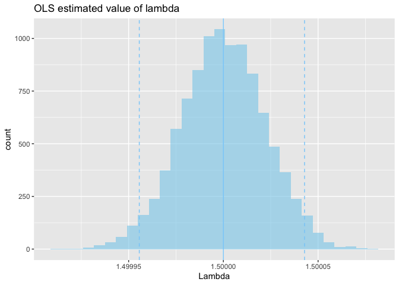

Demand Estimation: Cournot Model
================
Tomoya Ozawa
2021/05/14

## Data Generating Process

### Demand function

  
  

### Marginal cost function

  
  

### Price

  

")  

### Error terms

  
, \\  \\nu_t \\sim N(0, \\sigma_c), \\ Cov(\\sigma_D, \\sigma_c) = 0
")  

## Create a simulated data set

``` r
set.seed(123)
t <- 120
N <- 3

# Exogenous variables
X <- runif(t, min = 300, max = 600)
W <- runif(t, min = 30, max = 60)

# Parameters
kappa <- 3
lambda <- 1.5
mu <- 5
xi <- 3
omega <- 5

# Error terms
sigma_d <- 10
sigma_c <- 10
epsilon <- rnorm(t, mean = 0, sd = sigma_d)
nu <- rnorm(t, mean = 0, sd = sigma_c)
```

``` r
cost <- xi + omega*W + nu
price <- ((kappa + mu*X + epsilon)/lambda + cost*N)/(N + 1)
Q <- kappa - lambda*price + mu*X + epsilon
```

``` r
df <- data.frame(time = 1:t,
                 quantity = Q,
                 price = price,
                 cost = cost,
                 X = X,
                 W = W)
head(df)
```

    ##   time  quantity    price     cost        X        W
    ## 1    1 1179.0720 504.3138 242.2978 386.2733 49.43680
    ## 2    2 1786.5422 592.9605 195.9511 536.4915 39.59462
    ## 3    3 1342.7864 512.5156 214.1186 422.6931 39.23160
    ## 4    4 1922.3078 601.7716 174.5921 564.9052 36.59303
    ## 5    5 1966.6427 643.6645 206.6328 582.1402 41.08467
    ## 6    6  813.9979 500.5449 319.6565 313.6669 59.52658

``` r
df_param <- data.frame(true = c(kappa, lambda, mu, xi,omega))
rownames(df_param) <- c("kappa", "lambda", "mu", "xi","omega")
head(df_param)
```

    ##        true
    ## kappa   3.0
    ## lambda  1.5
    ## mu      5.0
    ## xi      3.0
    ## omega   5.0

## Estimation

### OLS

``` r
out_ols <- lm(quantity ~ price + X, data = df)
summary(out_ols)
```

    ## 
    ## Call:
    ## lm(formula = quantity ~ price + X, data = df)
    ## 
    ## Residuals:
    ##     Min      1Q  Median      3Q     Max 
    ## -19.690  -7.115  -1.395   5.877  33.106 
    ## 
    ## Coefficients:
    ##             Estimate Std. Error t value Pr(>|t|)    
    ## (Intercept) -2.77300    7.27035  -0.381    0.704    
    ## price       -1.48413    0.02872 -51.680   <2e-16 ***
    ## X            4.99292    0.02521 198.066   <2e-16 ***
    ## ---
    ## Signif. codes:  0 '***' 0.001 '**' 0.01 '*' 0.05 '.' 0.1 ' ' 1
    ## 
    ## Residual standard error: 9.894 on 117 degrees of freedom
    ## Multiple R-squared:  0.9991, Adjusted R-squared:  0.9991 
    ## F-statistic: 6.649e+04 on 2 and 117 DF,  p-value: < 2.2e-16

``` r
cost_ols <- ((N + 1)*df$price)/N - (out_ols$coefficients[1] + out_ols$coefficients[3]*df$X)/(-out_ols$coefficients[2]*N)
df$cost_ols <- cost_ols

out_cost_ols <- lm(cost_ols ~ W, data = df)
summary(out_cost_ols)
```

    ## 
    ## Call:
    ## lm(formula = cost_ols ~ W, data = df)
    ## 
    ## Residuals:
    ##      Min       1Q   Median       3Q      Max 
    ## -22.3412  -7.1373   0.8252   6.8454  21.0750 
    ## 
    ## Coefficients:
    ##             Estimate Std. Error t value Pr(>|t|)    
    ## (Intercept) -11.3698     5.4530  -2.085   0.0392 *  
    ## W             5.2629     0.1197  43.962   <2e-16 ***
    ## ---
    ## Signif. codes:  0 '***' 0.001 '**' 0.01 '*' 0.05 '.' 0.1 ' ' 1
    ## 
    ## Residual standard error: 10.22 on 118 degrees of freedom
    ## Multiple R-squared:  0.9425, Adjusted R-squared:  0.942 
    ## F-statistic:  1933 on 1 and 118 DF,  p-value: < 2.2e-16

### IV

``` r
# first stage
out_first <- lm(price ~ W + X, data = df)
summary(out_first)
```

    ## 
    ## Call:
    ## lm(formula = price ~ W + X, data = df)
    ## 
    ## Residuals:
    ##      Min       1Q   Median       3Q      Max 
    ## -16.5140  -5.2438   0.1417   5.7305  15.4698 
    ## 
    ## Coefficients:
    ##             Estimate Std. Error t value Pr(>|t|)    
    ## (Intercept) -1.92315    5.70591  -0.337    0.737    
    ## W            3.93421    0.08930  44.054   <2e-16 ***
    ## X            0.82674    0.00813 101.694   <2e-16 ***
    ## ---
    ## Signif. codes:  0 '***' 0.001 '**' 0.01 '*' 0.05 '.' 0.1 ' ' 1
    ## 
    ## Residual standard error: 7.595 on 117 degrees of freedom
    ## Multiple R-squared:   0.99,  Adjusted R-squared:  0.9899 
    ## F-statistic:  5811 on 2 and 117 DF,  p-value: < 2.2e-16

``` r
library(AER)
out_iv <- ivreg(quantity ~ price + X | W + X, data = df)
summary(out_iv)
```

    ## 
    ## Call:
    ## ivreg(formula = quantity ~ price + X | W + X, data = df)
    ## 
    ## Residuals:
    ##     Min      1Q  Median      3Q     Max 
    ## -19.664  -7.154  -1.295   6.012  33.056 
    ## 
    ## Coefficients:
    ##             Estimate Std. Error t value Pr(>|t|)    
    ## (Intercept) -2.01592    7.39088  -0.273    0.786    
    ## price       -1.48816    0.02957 -50.321   <2e-16 ***
    ## X            4.99613    0.02583 193.427   <2e-16 ***
    ## ---
    ## Signif. codes:  0 '***' 0.001 '**' 0.01 '*' 0.05 '.' 0.1 ' ' 1
    ## 
    ## Residual standard error: 9.895 on 117 degrees of freedom
    ## Multiple R-Squared: 0.9991,  Adjusted R-squared: 0.9991 
    ## Wald test: 6.641e+04 on 2 and 117 DF,  p-value: < 2.2e-16

``` r
cost_iv <- ((N + 1)*df$price)/N - (out_iv$coefficients[1] + out_iv$coefficients[3]*df$X)/(-out_iv$coefficients[2]*N)
df$cost_iv <- cost_iv

out_cost_iv <- lm(cost_iv ~ W, data = df)
summary(out_cost_iv)
```

    ## 
    ## Call:
    ## lm(formula = cost_iv ~ W, data = df)
    ## 
    ## Residuals:
    ##     Min      1Q  Median      3Q     Max 
    ## -22.238  -7.204   1.052   6.959  21.021 
    ## 
    ## Coefficients:
    ##             Estimate Std. Error t value Pr(>|t|)    
    ## (Intercept) -10.3976     5.4369  -1.912   0.0582 .  
    ## W             5.2608     0.1194  44.074   <2e-16 ***
    ## ---
    ## Signif. codes:  0 '***' 0.001 '**' 0.01 '*' 0.05 '.' 0.1 ' ' 1
    ## 
    ## Residual standard error: 10.19 on 118 degrees of freedom
    ## Multiple R-squared:  0.9427, Adjusted R-squared:  0.9422 
    ## F-statistic:  1943 on 1 and 118 DF,  p-value: < 2.2e-16

## Comparison of parameters

``` r
param_ols <- c(out_ols$coefficients, out_cost_ols$coefficients)
param_ols[2] <- -param_ols[2]
df_param$ols <- param_ols

param_iv <- c(out_iv$coefficients, out_cost_iv$coefficients)
param_iv[2] <- -param_iv[2]
df_param$iv <- param_iv

df_param
```

    ##        true        ols         iv
    ## kappa   3.0  -2.773005  -2.015922
    ## lambda  1.5   1.484130   1.488156
    ## mu      5.0   4.992924   4.996133
    ## xi      3.0 -11.369795 -10.397596
    ## omega   5.0   5.262935   5.260835

## Create simulated data sets

``` r
set.seed(123)
market <- 10000 # number of data sets
```

``` r
list_df <- list()
for ( i in 1:market){
  # Exogenous variables
  x <- runif(t, min = 300000, max = 600000)
  w <- runif(t, min = 30000, max = 60000)
  
  # Error terms
  epsilon <- rnorm(t, mean = 0, sd = sigma_d)
  nu <- rnorm(t, mean = 0, sd = sigma_c)
  
  # calculate
  cost <- xi + omega*w + nu
  price <- ((kappa + mu*x + epsilon)/lambda + cost*N)/(N + 1)
  Q <- kappa - lambda*price + mu*x + epsilon
  
  # aggregate as data frame
  temp <- data.frame(
    time = 1:t,
    quantity = Q,
    price = price,
    cost = cost,
    X = x,
    W = w,
    epsilon = epsilon,
    nu = nu
  )
  
  list_df <- c(list_df, list(temp))
}
```

## Estimation

### OLS

``` r
library(purrr)
list_out_ols <- map(list_df, ~lm(quantity ~ price + X, data = .x))
print(summary(list_out_ols[[1]]))
```

    ## 
    ## Call:
    ## lm(formula = quantity ~ price + X, data = .x)
    ## 
    ## Residuals:
    ##     Min      1Q  Median      3Q     Max 
    ## -19.581  -7.203  -1.236   6.013  33.094 
    ## 
    ## Coefficients:
    ##               Estimate Std. Error    t value Pr(>|t|)    
    ## (Intercept) -2.040e+00  7.438e+00     -0.274    0.784    
    ## price       -1.500e+00  3.104e-05 -48323.054   <2e-16 ***
    ## X            5.000e+00  2.713e-05 184285.499   <2e-16 ***
    ## ---
    ## Signif. codes:  0 '***' 0.001 '**' 0.01 '*' 0.05 '.' 0.1 ' ' 1
    ## 
    ## Residual standard error: 9.901 on 117 degrees of freedom
    ## Multiple R-squared:      1,  Adjusted R-squared:      1 
    ## F-statistic: 6.564e+10 on 2 and 117 DF,  p-value: < 2.2e-16

``` r
list_df_ols <- map2(list_df, list_out_ols, function(.x, .y){
  cbind(.x,
      data.frame(
    cost_ols = ((N + 1)*.x$price)/N - (.y$coefficients[1] + .y$coefficients[3]*.x$X)/(-.y$coefficients[2]*N)
    )
  )
})
```

``` r
list_out_cost_ols <- map(list_df_ols, ~lm(cost_ols ~ W, data = .x))
summary(list_out_cost_ols[[1]])
```

    ## 
    ## Call:
    ## lm(formula = cost_ols ~ W, data = .x)
    ## 
    ## Residuals:
    ##     Min      1Q  Median      3Q     Max 
    ## -22.241  -7.226   1.028   6.960  21.026 
    ## 
    ## Coefficients:
    ##               Estimate Std. Error   t value Pr(>|t|)    
    ## (Intercept) -1.052e+01  5.439e+00    -1.934   0.0555 .  
    ## W            5.000e+00  1.194e-04 41878.451   <2e-16 ***
    ## ---
    ## Signif. codes:  0 '***' 0.001 '**' 0.01 '*' 0.05 '.' 0.1 ' ' 1
    ## 
    ## Residual standard error: 10.19 on 118 degrees of freedom
    ## Multiple R-squared:      1,  Adjusted R-squared:      1 
    ## F-statistic: 1.754e+09 on 1 and 118 DF,  p-value: < 2.2e-16

### IV

``` r
list_out_iv <- map(list_df, ~ivreg(quantity ~ price + X, data = .x))
print(summary(list_out_iv[[1]]))
```

    ## 
    ## Call:
    ## ivreg(formula = quantity ~ price + X, data = .x)
    ## 
    ## Residuals:
    ##     Min      1Q  Median      3Q     Max 
    ## -19.581  -7.203  -1.236   6.013  33.094 
    ## 
    ## Coefficients:
    ##               Estimate Std. Error    t value Pr(>|t|)    
    ## (Intercept) -2.040e+00  7.438e+00     -0.274    0.784    
    ## price       -1.500e+00  3.104e-05 -48323.054   <2e-16 ***
    ## X            5.000e+00  2.713e-05 184285.499   <2e-16 ***
    ## ---
    ## Signif. codes:  0 '***' 0.001 '**' 0.01 '*' 0.05 '.' 0.1 ' ' 1
    ## 
    ## Residual standard error: 9.901 on 117 degrees of freedom
    ## Multiple R-Squared:     1,   Adjusted R-squared:     1 
    ## Wald test: 6.564e+10 on 2 and 117 DF,  p-value: < 2.2e-16

``` r
list_df_iv <- map2(list_df, list_out_iv, function(.x, .y){
  cbind(.x,
      data.frame(
    cost_iv = ((N + 1)*.x$price)/N - (.y$coefficients[1] + .y$coefficients[3]*.x$X)/(-.y$coefficients[2]*N)
    )
  )
})
```

``` r
list_out_cost_iv <- map(list_df_iv, ~lm(cost_iv ~ W, data = .x))
summary(list_out_cost_iv[[1]])
```

    ## 
    ## Call:
    ## lm(formula = cost_iv ~ W, data = .x)
    ## 
    ## Residuals:
    ##     Min      1Q  Median      3Q     Max 
    ## -22.241  -7.226   1.028   6.960  21.026 
    ## 
    ## Coefficients:
    ##               Estimate Std. Error   t value Pr(>|t|)    
    ## (Intercept) -1.052e+01  5.439e+00    -1.934   0.0555 .  
    ## W            5.000e+00  1.194e-04 41878.451   <2e-16 ***
    ## ---
    ## Signif. codes:  0 '***' 0.001 '**' 0.01 '*' 0.05 '.' 0.1 ' ' 1
    ## 
    ## Residual standard error: 10.19 on 118 degrees of freedom
    ## Multiple R-squared:      1,  Adjusted R-squared:      1 
    ## F-statistic: 1.754e+09 on 1 and 118 DF,  p-value: < 2.2e-16

## Comparison of parameters

``` r
df_param_unlist_ols <- map2_dfr(list_out_ols, list_out_cost_ols, function(.x, .y){
  data.frame(
    Kappa = .x$coefficients[1],
    Lambda = -.x$coefficients[2],
    Mu = .x$coefficients[3],
    Xi = .y$coefficients[1],
    Omega = .y$coefficients[2]
  )
})
```

``` r
df_param_unlist_iv <- map2_dfr(list_out_iv, list_out_cost_iv, function(.x, .y){
  data.frame(
    Kappa = .x$coefficients[1],
    Lambda = - .x$coefficients[2],
    Mu = .x$coefficients[3],
    Xi = .y$coefficients[1],
    Omega = .y$coefficients[2]
  )
})
```

``` r
library(ggplot2)
q_ols <- quantile(df_param_unlist_ols$Lambda, prob=c(0.025, 0.975))

g_ols <- ggplot(df_param_unlist_ols, aes(x = Lambda)) + 
  geom_histogram(fill = "skyblue", alpha=0.6) + 
  ggtitle("OLS estimated value of lambda") + 
  geom_vline(xintercept = q_ols[1], linetype = "dashed", colour = "lightskyblue") + 
  geom_vline(xintercept = q_ols[2], linetype = "dashed", colour = "lightskyblue") + 
  geom_vline(xintercept = lambda, colour = "lightskyblue")

plot(g_ols)
```

    ## `stat_bin()` using `bins = 30`. Pick better value with `binwidth`.

<!-- -->

``` r
q_iv <- quantile(df_param_unlist_iv$Lambda, prob=c(0.025, 0.975))

g_iv <- ggplot(df_param_unlist_iv, aes(x = Lambda)) + 
  geom_histogram(fill = "skyblue", alpha=0.6) + 
  ggtitle("IV estimated value of lambda") + 
  geom_vline(xintercept = q_iv[1], linetype = "dashed", colour = "lightskyblue") + 
  geom_vline(xintercept = q_iv[2], linetype = "dashed", colour = "lightskyblue") + 
  geom_vline(xintercept = lambda, colour = "lightskyblue")

plot(g_iv)
```

    ## `stat_bin()` using `bins = 30`. Pick better value with `binwidth`.

<!-- -->
