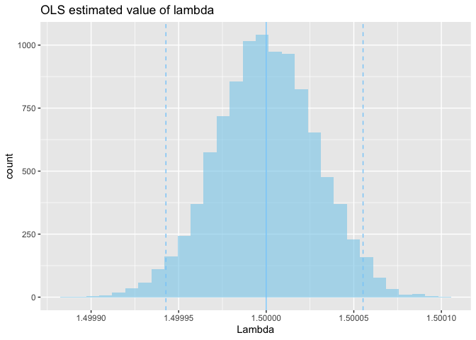
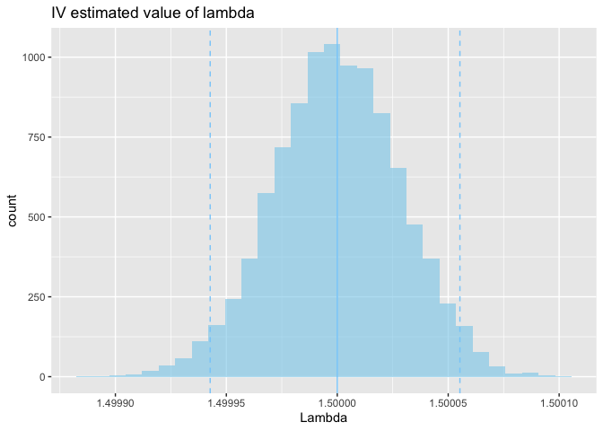

Demand Estimation: Cournot Model
================
Tomoya Ozawa
2021/05/13

## Data Generating Process

### Demand function

  
  

### Marginal cost function

  
  

### Price

  

")  

### Error terms

  
, \\  \\nu_t \\sim N(0, \\sigma_c), \\ Cov(\\sigma_D, \\sigma_c) = 0
")  

## Create a simulated data set

``` r
set.seed(123)
t <- 120
N <- 30

# Exogenous variables
X <- runif(t, min = 300, max = 600)
W <- runif(t, min = 30, max = 60)

# Parameters
kappa <- 3
lambda <- 1.5
mu <- 5
xi <- 3
omega <- 5

# Error terms
sigma_d <- 10
sigma_c <- 10
epsilon <- rnorm(t, mean = 0, sd = sigma_d)
nu <- rnorm(t, mean = 0, sd = sigma_c)
```

``` r
cost <- xi + omega*W + nu
price <- ((kappa + mu*X + epsilon)/lambda + cost*N)/(N + 1)
Q <- kappa - lambda*price + mu*X + epsilon
```

``` r
df <- data.frame(time = 1:t,
                 quantity = Q,
                 price = price,
                 cost = cost,
                 X = X,
                 W = W)
head(df)
```

    ##   time quantity    price     cost        X        W
    ## 1    1 1521.383 276.1063 242.2978 386.2733 49.43680
    ## 2    2 2305.216 247.1781 195.9511 536.4915 39.59462
    ## 3    3 1732.628 252.6214 214.1186 422.6931 39.23160
    ## 4    4 2480.397 229.7120 174.5921 564.9052 36.59303
    ## 5    5 2537.604 263.0240 206.6328 582.1402 41.08467
    ## 6    6 1050.320 342.9969 319.6565 313.6669 59.52658

``` r
df_param <- data.frame(true = c(kappa, lambda, mu, xi,omega))
rownames(df_param) <- c("kappa", "lambda", "mu", "xi","omega")
head(df_param)
```

    ##        true
    ## kappa   3.0
    ## lambda  1.5
    ## mu      5.0
    ## xi      3.0
    ## omega   5.0

## Estimation

### OLS

``` r
out_ols <- lm(quantity ~ price + X, data = df)
summary(out_ols)
```

    ## 
    ## Call:
    ## lm(formula = quantity ~ price + X, data = df)
    ## 
    ## Residuals:
    ##     Min      1Q  Median      3Q     Max 
    ## -19.601  -7.129  -1.364   6.021  32.933 
    ## 
    ## Coefficients:
    ##             Estimate Std. Error t value Pr(>|t|)    
    ## (Intercept) -0.04492    7.28429  -0.006    0.995    
    ## price       -1.49894    0.02231 -67.176   <2e-16 ***
    ## X            5.00551    0.01065 469.917   <2e-16 ***
    ## ---
    ## Signif. codes:  0 '***' 0.001 '**' 0.01 '*' 0.05 '.' 0.1 ' ' 1
    ## 
    ## Residual standard error: 9.907 on 117 degrees of freedom
    ## Multiple R-squared:  0.9995, Adjusted R-squared:  0.9995 
    ## F-statistic: 1.104e+05 on 2 and 117 DF,  p-value: < 2.2e-16

``` r
cost_ols <- ((N + 1)*df$price)/N - (out_ols$coefficients[1] + out_ols$coefficients[3]*df$X)/(-out_ols$coefficients[2]*N)
df$cost_ols <- cost_ols

out_cost_ols <- lm(cost_ols ~ W, data = df)
summary(out_cost_ols)
```

    ## 
    ## Call:
    ## lm(formula = cost_ols ~ W, data = df)
    ## 
    ## Residuals:
    ##      Min       1Q   Median       3Q      Max 
    ## -22.9223  -5.9707   0.1905   6.9518  22.4246 
    ## 
    ## Coefficients:
    ##             Estimate Std. Error t value Pr(>|t|)    
    ## (Intercept)  -7.1847     5.4383  -1.321    0.189    
    ## W             5.2455     0.1194  43.935   <2e-16 ***
    ## ---
    ## Signif. codes:  0 '***' 0.001 '**' 0.01 '*' 0.05 '.' 0.1 ' ' 1
    ## 
    ## Residual standard error: 10.19 on 118 degrees of freedom
    ## Multiple R-squared:  0.9424, Adjusted R-squared:  0.9419 
    ## F-statistic:  1930 on 1 and 118 DF,  p-value: < 2.2e-16

### IV

``` r
# first stage
out_first <- lm(price ~ W + X, data = df)
summary(out_first)
```

    ## 
    ## Call:
    ## lm(formula = price ~ W + X, data = df)
    ## 
    ## Residuals:
    ##      Min       1Q   Median       3Q      Max 
    ## -22.6719  -6.5736   0.2876   6.7779  21.4697 
    ## 
    ## Coefficients:
    ##             Estimate Std. Error t value Pr(>|t|)    
    ## (Intercept) -2.08689    7.41175  -0.282    0.779    
    ## W            5.06739    0.11600  43.684  < 2e-16 ***
    ## X            0.09787    0.01056   9.268 1.16e-15 ***
    ## ---
    ## Signif. codes:  0 '***' 0.001 '**' 0.01 '*' 0.05 '.' 0.1 ' ' 1
    ## 
    ## Residual standard error: 9.866 on 117 degrees of freedom
    ## Multiple R-squared:  0.9431, Adjusted R-squared:  0.9422 
    ## F-statistic: 970.3 on 2 and 117 DF,  p-value: < 2.2e-16

``` r
library(AER)
out_iv <- ivreg(quantity ~ price + X | W + X, data = df)
summary(out_iv)
```

    ## 
    ## Call:
    ## ivreg(formula = quantity ~ price + X | W + X, data = df)
    ## 
    ## Residuals:
    ##     Min      1Q  Median      3Q     Max 
    ## -19.699  -7.167  -1.298   6.023  33.115 
    ## 
    ## Coefficients:
    ##             Estimate Std. Error t value Pr(>|t|)    
    ## (Intercept) -2.01951    7.41079  -0.273    0.786    
    ## price       -1.49080    0.02300 -64.815   <2e-16 ***
    ## X            5.00503    0.01066 469.379   <2e-16 ***
    ## ---
    ## Signif. codes:  0 '***' 0.001 '**' 0.01 '*' 0.05 '.' 0.1 ' ' 1
    ## 
    ## Residual standard error: 9.913 on 117 degrees of freedom
    ## Multiple R-Squared: 0.9995,  Adjusted R-squared: 0.9995 
    ## Wald test: 1.102e+05 on 2 and 117 DF,  p-value: < 2.2e-16

``` r
cost_iv <- ((N + 1)*df$price)/N - (out_iv$coefficients[1] + out_iv$coefficients[3]*df$X)/(-out_iv$coefficients[2]*N)
df$cost_iv <- cost_iv

out_cost_iv <- lm(cost_iv ~ W, data = df)
summary(out_cost_iv)
```

    ## 
    ## Call:
    ## lm(formula = cost_iv ~ W, data = df)
    ## 
    ## Residuals:
    ##      Min       1Q   Median       3Q      Max 
    ## -22.9301  -5.9409   0.1875   7.0017  22.4386 
    ## 
    ## Coefficients:
    ##             Estimate Std. Error t value Pr(>|t|)    
    ## (Intercept)  -7.4354     5.4407  -1.367    0.174    
    ## W             5.2461     0.1194  43.920   <2e-16 ***
    ## ---
    ## Signif. codes:  0 '***' 0.001 '**' 0.01 '*' 0.05 '.' 0.1 ' ' 1
    ## 
    ## Residual standard error: 10.19 on 118 degrees of freedom
    ## Multiple R-squared:  0.9424, Adjusted R-squared:  0.9419 
    ## F-statistic:  1929 on 1 and 118 DF,  p-value: < 2.2e-16

## Comparison of parameters

``` r
param_ols <- c(out_ols$coefficients, out_cost_ols$coefficients)
param_ols[2] <- -param_ols[2]
df_param$ols <- param_ols

param_iv <- c(out_iv$coefficients, out_cost_iv$coefficients)
param_iv[2] <- -param_iv[2]
df_param$iv <- param_iv

df_param
```

    ##        true         ols        iv
    ## kappa   3.0 -0.04491832 -2.019510
    ## lambda  1.5  1.49894387  1.490804
    ## mu      5.0  5.00551188  5.005025
    ## xi      3.0 -7.18474299 -7.435398
    ## omega   5.0  5.24553564  5.246077

## Create simulated data sets

``` r
set.seed(123)
market <- 10000 # number of data sets
```

``` r
list_df <- list()
for ( i in 1:market){
  # Exogenous variables
  x <- runif(t, min = 300000, max = 600000)
  w <- runif(t, min = 30000, max = 60000)
  
  # Error terms
  epsilon <- rnorm(t, mean = 0, sd = sigma_d)
  nu <- rnorm(t, mean = 0, sd = sigma_c)
  
  # calculate
  cost <- xi + omega*w + nu
  price <- ((kappa + mu*x + epsilon)/lambda + cost*N)/(N + 1)
  Q <- kappa - lambda*price + mu*x + epsilon
  
  # aggregate as data frame
  temp <- data.frame(
    time = 1:t,
    quantity = Q,
    price = price,
    cost = cost,
    X = x,
    W = w,
    epsilon = epsilon,
    nu = nu
  )
  
  list_df <- c(list_df, list(temp))
}
```

## Estimation

### OLS

``` r
library(purrr)
list_out_ols <- map(list_df, ~lm(quantity ~ price + X, data = .x))
print(summary(list_out_ols[[1]]))
```

    ## 
    ## Call:
    ## lm(formula = quantity ~ price + X, data = .x)
    ## 
    ## Residuals:
    ##     Min      1Q  Median      3Q     Max 
    ## -19.581  -7.203  -1.236   6.014  33.094 
    ## 
    ## Coefficients:
    ##               Estimate Std. Error    t value Pr(>|t|)    
    ## (Intercept) -2.037e+00  7.438e+00     -0.274    0.785    
    ## price       -1.500e+00  2.406e-05 -62352.212   <2e-16 ***
    ## X            5.000e+00  1.070e-05 467345.618   <2e-16 ***
    ## ---
    ## Signif. codes:  0 '***' 0.001 '**' 0.01 '*' 0.05 '.' 0.1 ' ' 1
    ## 
    ## Residual standard error: 9.901 on 117 degrees of freedom
    ## Multiple R-squared:      1,  Adjusted R-squared:      1 
    ## F-statistic: 1.093e+11 on 2 and 117 DF,  p-value: < 2.2e-16

``` r
list_df_ols <- map2(list_df, list_out_ols, function(.x, .y){
  cbind(.x,
      data.frame(
    cost_ols = ((N + 1)*.x$price)/N - (.y$coefficients[1] + .y$coefficients[3]*.x$X)/(-.y$coefficients[2]*N)
    )
  )
})
```

``` r
list_out_cost_ols <- map(list_df_ols, ~lm(cost_ols ~ W, data = .x))
summary(list_out_cost_ols[[1]])
```

    ## 
    ## Call:
    ## lm(formula = cost_ols ~ W, data = .x)
    ## 
    ## Residuals:
    ##      Min       1Q   Median       3Q      Max 
    ## -22.9304  -5.9398   0.1874   7.0037  22.4392 
    ## 
    ## Coefficients:
    ##               Estimate Std. Error   t value Pr(>|t|)    
    ## (Intercept) -7.4469617  5.4407907    -1.369    0.174    
    ## W            5.0002461  0.0001194 41860.849   <2e-16 ***
    ## ---
    ## Signif. codes:  0 '***' 0.001 '**' 0.01 '*' 0.05 '.' 0.1 ' ' 1
    ## 
    ## Residual standard error: 10.19 on 118 degrees of freedom
    ## Multiple R-squared:      1,  Adjusted R-squared:      1 
    ## F-statistic: 1.752e+09 on 1 and 118 DF,  p-value: < 2.2e-16

### IV

``` r
list_out_iv <- map(list_df, ~ivreg(quantity ~ price + X, data = .x))
print(summary(list_out_iv[[1]]))
```

    ## 
    ## Call:
    ## ivreg(formula = quantity ~ price + X, data = .x)
    ## 
    ## Residuals:
    ##     Min      1Q  Median      3Q     Max 
    ## -19.581  -7.203  -1.236   6.014  33.094 
    ## 
    ## Coefficients:
    ##               Estimate Std. Error    t value Pr(>|t|)    
    ## (Intercept) -2.037e+00  7.438e+00     -0.274    0.785    
    ## price       -1.500e+00  2.406e-05 -62352.212   <2e-16 ***
    ## X            5.000e+00  1.070e-05 467345.618   <2e-16 ***
    ## ---
    ## Signif. codes:  0 '***' 0.001 '**' 0.01 '*' 0.05 '.' 0.1 ' ' 1
    ## 
    ## Residual standard error: 9.901 on 117 degrees of freedom
    ## Multiple R-Squared:     1,   Adjusted R-squared:     1 
    ## Wald test: 1.093e+11 on 2 and 117 DF,  p-value: < 2.2e-16

``` r
list_df_iv <- map2(list_df, list_out_iv, function(.x, .y){
  cbind(.x,
      data.frame(
    cost_iv = ((N + 1)*.x$price)/N - (.y$coefficients[1] + .y$coefficients[3]*.x$X)/(-.y$coefficients[2]*N)
    )
  )
})
```

``` r
list_out_cost_iv <- map(list_df_iv, ~lm(cost_iv ~ W, data = .x))
summary(list_out_cost_iv[[1]])
```

    ## 
    ## Call:
    ## lm(formula = cost_iv ~ W, data = .x)
    ## 
    ## Residuals:
    ##      Min       1Q   Median       3Q      Max 
    ## -22.9304  -5.9398   0.1874   7.0037  22.4392 
    ## 
    ## Coefficients:
    ##               Estimate Std. Error   t value Pr(>|t|)    
    ## (Intercept) -7.4469617  5.4407907    -1.369    0.174    
    ## W            5.0002461  0.0001194 41860.849   <2e-16 ***
    ## ---
    ## Signif. codes:  0 '***' 0.001 '**' 0.01 '*' 0.05 '.' 0.1 ' ' 1
    ## 
    ## Residual standard error: 10.19 on 118 degrees of freedom
    ## Multiple R-squared:      1,  Adjusted R-squared:      1 
    ## F-statistic: 1.752e+09 on 1 and 118 DF,  p-value: < 2.2e-16

## Comparison of parameters

``` r
df_param_unlist_ols <- map2_dfr(list_out_ols, list_out_cost_ols, function(.x, .y){
  data.frame(
    Kappa = .x$coefficients[1],
    Lambda = -.x$coefficients[2],
    Mu = .x$coefficients[3],
    Xi = .y$coefficients[1],
    Omega = .y$coefficients[2]
  )
})
```

``` r
df_param_unlist_iv <- map2_dfr(list_out_iv, list_out_cost_iv, function(.x, .y){
  data.frame(
    Kappa = .x$coefficients[1],
    Lambda = - .x$coefficients[2],
    Mu = .x$coefficients[3],
    Xi = .y$coefficients[1],
    Omega = .y$coefficients[2]
  )
})
```

``` r
library(ggplot2)
q_ols <- quantile(df_param_unlist_ols$Lambda, prob=c(0.025, 0.975))

g_ols <- ggplot(df_param_unlist_ols, aes(x = Lambda)) + 
  geom_histogram(fill = "skyblue", alpha=0.6) + 
  ggtitle("OLS estimated value of lambda") + 
  geom_vline(xintercept = q_ols[1], linetype = "dashed", colour = "lightskyblue") + 
  geom_vline(xintercept = q_ols[2], linetype = "dashed", colour = "lightskyblue") + 
  geom_vline(xintercept = lambda, colour = "lightskyblue")

plot(g_ols)
```

    ## `stat_bin()` using `bins = 30`. Pick better value with `binwidth`.

<!-- -->

``` r
q_iv <- quantile(df_param_unlist_iv$Lambda, prob=c(0.025, 0.975))

g_iv <- ggplot(df_param_unlist_iv, aes(x = Lambda)) + 
  geom_histogram(fill = "skyblue", alpha=0.6) + 
  ggtitle("IV estimated value of lambda") + 
  geom_vline(xintercept = q_iv[1], linetype = "dashed", colour = "lightskyblue") + 
  geom_vline(xintercept = q_iv[2], linetype = "dashed", colour = "lightskyblue") + 
  geom_vline(xintercept = lambda, colour = "lightskyblue")

plot(g_iv)
```

    ## `stat_bin()` using `bins = 30`. Pick better value with `binwidth`.

<!-- -->
